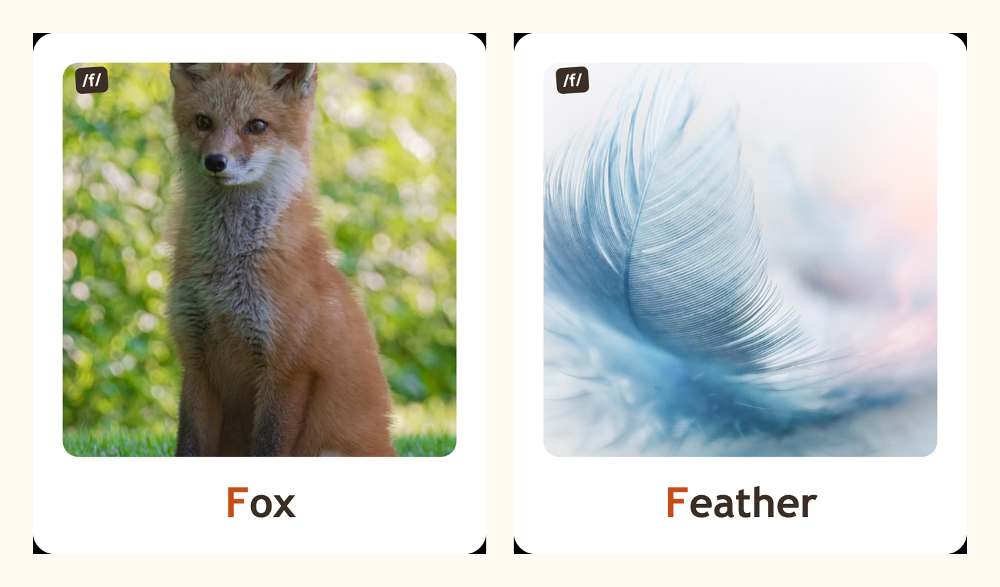

# 🦊 Phonics Card Maker

Make printable **phonics flash cards** for kids — pick a sound, choose words,
pick a picture, then print or download. Works in **English** and **हिंदी**.

**▶ Live app:** https://narender-khola.github.io/phonics-card-maker/

<p align="center">
  
  <br><i>Photo on top, word below, with the leading letter highlighted.</i>
</p>

## What it does

- **Pick a sound / letter** — English `a–z` or Hindi अ, क, फ … (व्यंजन & स्वर)
- **Choose words** from a built-in kid-friendly bank, or **type your own**
- **Pick a picture** — real photos fetched live from Pixabay (with Openverse &
  Wikimedia Commons as fallback). Every session pulls a **random pool**, so
  different families don't all end up with the same photo.
- **Download** any single card as a PNG, or **Print cut sheet** — laid out for
  **6×4 inch photo paper, two cards per sheet**, with dashed cut lines.

## Run it locally

It's a single static file — no build step.

```bash
# any static server works; e.g.
python3 -m http.server 8000
# then open http://localhost:8000/
```

## Picture source (Pixabay key)

The app uses [Pixabay](https://pixabay.com/api/docs/) for the cleanest photos.
Get a **free** API key (30s, no card) and paste it into `index.html`:

```js
const PIXABAY_KEY = "your-key-here";
```

Leave it `""` to fall back to Openverse (no key needed). Because this is a
client-side app, the key is visible to anyone using the site — that's expected
for Pixabay's client keys; use a throwaway/free key.

## Offline template (`make_cards.py`)

Prefer to bake a fixed set of cards from your **own** photos (no internet at
print time)? Drop images into `images/`, edit the `CONFIG` block in
`make_cards.py`, then:

```bash
python3 make_cards.py      # writes a self-contained cards.html
```

## Build stamp

`./stamp.sh` writes the current git SHA + UTC time into the footer before a
deploy (run automatically is fine; it's idempotent).

## License

MIT — see [LICENSE](LICENSE). Photos belong to their respective creators via
Pixabay / Openverse / Wikimedia Commons licenses.
